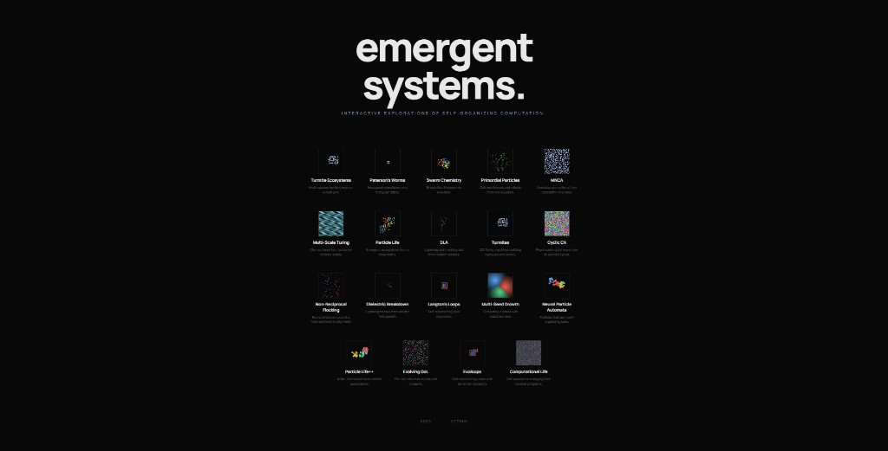

<div align="center">

<h1>emergent systems.</h1>
<h3><em>Interactive explorations of self-organizing computation.</em></h3>

<p>
  <a href="https://github.com/Ijtihed/emergentSystems"></a>
  <a href="https://github.com/Ijtihed/emergentSystems"></a>
  <a href="https://github.com/Ijtihed/emergentSystems"></a>
  <a href="https://github.com/Ijtihed/emergentSystems/blob/master/LICENSE"></a>
</p>

<br />

<!-- Add your screenshot here -->
<!--  -->

</div>

---

> 23 browser-based simulations of cellular automata, particle systems, and artificial life. Each one is faithful to the original research paper. No build step, no dependencies, no frameworks. Just HTML, CSS, and Canvas.

---

## Demos

| # | Demo | Paper | Year |
|---|------|-------|------|
| 01 | [**Particle Life**](particle-life/index.html) | Ventrella, Clusters. Hunar Ahmad, brainxyz. | 2005, 2022 |
| 02 | [**Turmite Ecosystems**](turmite-ecosystems/index.html) | Multi-species extension of Langton's Ant. Ed Pegg survey. | 1986 |
| 03 | [**Primordial Particles**](primordial-particles/index.html) | Schmickl et al., Scientific Reports. | 2016 |
| 04 | [**Swarm Chemistry**](swarm-chemistry/index.html) | Sayama, Artificial Life 15(1). ISAL Paper of the Decade. | 2009 |
| 05 | [**Turmites**](turmites/index.html) | Langton's Ant generalized to N colors, M states. | 1986 |
| 06 | [**MNCA**](mnca/index.html) | Slackermanz, Multiple Neighborhood Cellular Automata. | 2014 |
| 07 | [**Multi-Scale Turing**](turing-patterns/index.html) | McCabe, Cyclic Symmetric Multi-Scale Turing Patterns, Bridges. | 2010 |
| 08 | [**Paterson's Worms**](paterson-worms/index.html) | Paterson and Conway. Martin Gardner, Scientific American. | 1971 |
| 09 | [**DLA**](dla/index.html) | Witten and Sander, Diffusion-Limited Aggregation. | 1981 |
| 10 | [**Physarum**](physarum/index.html) | Jones, Artificial Life journal. | 2010 |
| 11 | [**Abelian Sandpile**](sandpile/index.html) | Bak, Tang, Wiesenfeld. Self-organized criticality. | 1987 |
| 12 | [**Reaction-Diffusion**](reaction-diffusion/index.html) | Turing 1952. Gray-Scott 1983. Spatial f/k painting. | 1952 |
| 13 | [**DiffLogic CA**](difflogic-ca/index.html) | Miotti, Niklasson, Randazzo, Mordvintsev. Google. | 2025 |
| 14 | [**Cyclic CA**](cyclic-ca/index.html) | Greenberg and Hastings. Fisch, Gravner, Griffeath. | 1978 |
| 15 | [**Non-Reciprocal Flocking**](flocking/index.html) | Chatterjee et al., Communications Physics. | 2025 |
| 16 | [**Dielectric Breakdown**](dielectric-breakdown/index.html) | Niemeyer, Pietronero, Wiesmann, Phys. Rev. Lett. | 1984 |
| 17 | [**Langton's Loops**](langton-loops/index.html) | Langton, Self-reproduction in cellular automata. | 1984 |
| 18 | [**Multi-Seed Growth**](multi-seed-growth/index.html) | Eden 1961. Wilkinson and Willemsen 1983. | 1961 |
| 19 | [**Neural Particle Automata**](neural-particles/index.html) | Zhu et al., arXiv:2601.16096. | 2026 |
| 20 | [**Particle Life++**](particle-life-plus/index.html) | Sakana AI, ASAL. Foundation model-guided discovery. | 2024 |
| 21 | [**Evolving GoL**](het-gol/index.html) | Plantec et al., arXiv:2406.13383. | 2024 |
| 22 | [**Evoloops**](evoloops/index.html) | Sayama. First CA with Darwinian evolution. | 1999 |
| 23 | [**Computational Life**](computational-life/index.html) | Aguera y Arcas et al., Google. arXiv:2406.19108. | 2024 |

## How It Works

Every demo follows the same pattern.

1. Read the paper.
2. Implement the exact algorithm described.
3. Audit the implementation against the source.
4. Wrap it in a minimal dark UI with sliders and a canvas.

Each simulation runs entirely in the browser. No server, no WebGL, no WASM. Just `requestAnimationFrame` and typed arrays on a 2D canvas. Most simulations run at 30-60 fps on modern hardware.

## Running Locally

```bash
npx http-server -p 3000 -c-1
```

Then open http://localhost:3000. The `-c-1` flag disables caching so you always get fresh files.

## Project Structure

```
emergentSystems/
  index.html              Landing page with preview thumbnails
  style.css               Shared dark theme (Manrope + Inter + JetBrains Mono)
  particle-life/           Each demo is self-contained
    index.html              Info bar + canvas + controls
    sim.js                  Simulation engine
  turmites/
  mnca/
  ... (23 demo folders)
  docs/
    roadmap.md             Future demos and expansion areas
```

Each demo folder is completely independent. No shared JS libraries, no imports between demos. You can copy any folder and it works standalone with just the CSS.

## Paper Accuracy

Every simulation was audited against its source paper. The info bar on each demo page links directly to the original research. Where the implementation simplifies or deviates from the paper, this is stated explicitly in the description.

Simulations that were audited and corrected include fixes for boundary conditions (Sandpile), ring offset decoding (MNCA), position wrapping (Particle Life), direction semantics (Paterson's Worms), execution order (Computational Life), and mass conservation (previously removed Flow-Lenia).

## References

<details>
<summary>Full citation list (25 papers)</summary>

- Ventrella, Jeffrey (2005). Clusters.
- Langton, Chris (1986). Langton's Ant.
- Schmickl et al. (2016). How a life-like system emerges from a simple particle motion law. Scientific Reports.
- Sayama, Hiroki (2009). Swarm Chemistry. Artificial Life 15(1).
- Slackermanz (2014). Multiple Neighborhood Cellular Automata.
- McCabe, Jonathan (2010). Cyclic Symmetric Multi-Scale Turing Patterns. Bridges.
- Paterson, Mike and Conway, John (1971). Paterson's Worms.
- Witten and Sander (1981). Diffusion-Limited Aggregation.
- Jones, Jeff (2010). Physarum Transport Networks. Artificial Life.
- Bak, Tang, Wiesenfeld (1987). Self-Organized Criticality.
- Turing, Alan (1952). The Chemical Basis of Morphogenesis.
- Gray and Scott (1983). Autocatalytic reactions in an isothermal CSTR.
- Miotti, Niklasson, Randazzo, Mordvintsev (2025). Differentiable Logic Cellular Automata. Google.
- Greenberg and Hastings (1978). Spatial patterns for discrete models of diffusion.
- Fisch, Gravner, Griffeath (1991). Cyclic cellular automata phase diagram.
- Chatterjee et al. (2025). Emergent complex phases in a discrete flocking model. Communications Physics.
- Niemeyer, Pietronero, Wiesmann (1984). Fractal dimension of dielectric breakdown.
- Langton, Christopher (1984). Self-reproduction in cellular automata.
- Eden, Murray (1961). Two-dimensional growth process.
- Wilkinson and Willemsen (1983). Invasion percolation.
- Zhu et al. (2026). Neural Particle Automata. arXiv:2601.16096.
- Sakana AI (2024). ASAL, Automating the Search for Artificial Life.
- Plantec et al. (2024). Evolving Game of Life. arXiv:2406.13383.
- Sayama, Hiroki (1999). Evoloops.
- Aguera y Arcas et al. (2024). Computational Life. arXiv:2406.19108.

</details>

## License

[MIT](LICENSE)

---

<div align="center">
<sub>Built by <a href="https://github.com/Ijtihed">Ijtihed</a></sub>
</div>
